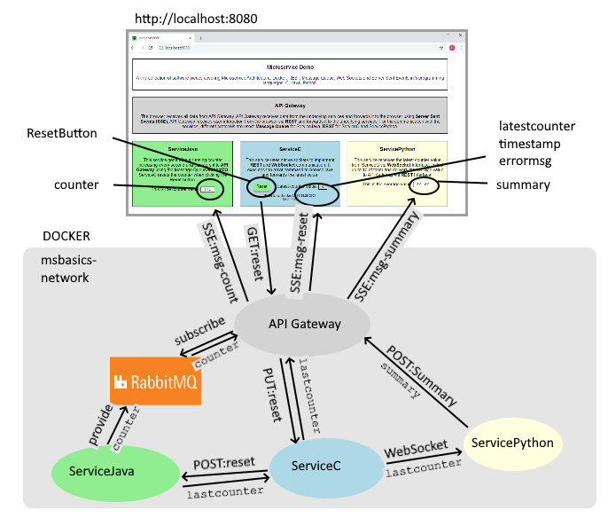
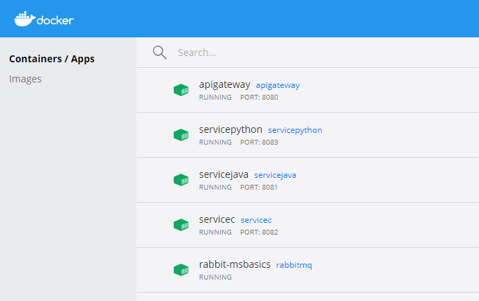

# Microservice Basics  

(or: *what I have learned in the last few weeks*)

This is a small collection of software pieces with the intention to show the use of different architecture elements in cloud-based solutions with implementation in different programming languages: C, Java, Python.

## Overview  

A quite simple web site shows on port 8080 four active elements:

-  a `counter` field that is increased every second

- a `Reset` Button that sets the counter to 0

- a `latest counter` field that shows the counter value at the time of reset (+ timestamp + possible errors)

- an `average` field that shows the average of the last 10 reset counters.
 

The web site gets it's data from a microservice `API Gateway` which gets it's data from three different services:

- `ServiceJava` for the `counter` value

- `ServiceC` for the `lastcounter` value

- `ServicePython` for the Average of the latest 10 counters (namend `summary`). 

 

 

## Elements

The elements I intend to show in this small examples are:  

| Element | Description | Link |  
| -- | -- | -- |  
| Docker | Some kind of virtual machines ("Containers") to keep microservices in a closed environment | https://docs.docker.com/reference/ |
| Microservices | An architecture principle for cloud based applications, as descibed in the link | https://www.marcobehler.com/guides/java-microservices-a-practical-guide |
| REST | HTTP based communication between microservices, with structured JSON payload | https://restfulapi.net/ |
| SSE | Server Sent Events: an easy way to transfer small pieces of data between microservices and browsers | https://developer.mozilla.org/en-US/docs/Web/API/Server-sent_events |
| WebSockets | A connection oriented communication, with handshake, data transfer, close, ping and pong | https://websockets.readthedocs.io/en/stable/intro.html   https://tools.ietf.org/html/rfc6455 |
| Message Queues | A stateless communication method usually used between one provider and multiple subscribers | https://www.rabbitmq.com/ |
---------  
 

## The Environment 

- Docker Desktop 
I use the latest version of Docker Desktop (20.10.2) for Windows, installed from the [Docker site](https://www.docker.com/get-started) . All containers are connected through a bridge network named "msbasics-network"
- Rabbit MQ 
There is a [Docker Official Image](https://hub.docker.com/_/rabbitmq) for Rabbit MQ. You can get it by calling: 
`PS> docker pull rabbitmq`
- The Windows command file `\init.cmd` starts the network and the RabbitMQ container (provided Docker Desktop is running) 
- for the Java parts, I use OpenJDK 10.0.1 from AdoptOpenJDK
- For the Python software, I use Python 3.9.1
- For C code, I use gcc in two flavors: For Windows, I have MinGW64 from [MSYS2](https://www.msys2.org/), for Linux I use gcc from the Ubuntu release 20.0.4, as a client in Windows [WSL2](https://docs.microsoft.com/de-de/windows/wsl/install-win10).
- For editing, I use [Visual Studio Code](https://code.visualstudio.com/).

## The Microservices

- API Gateway (port `8080`) 
  This service handles the interface to the user through `port 8080`, which is exported from Docker to the outside world.
  It's internal IP address is `0.0.0.0` since Docker has it's own network and does not know `localhost`.
  In the browser, the user calls `http://localhost:8080` to get access to API Gateway. The Java Software in API Gateway runs the HTTP Server from  `com.sum.net.httpserver`. The following URIs are served: 
  - `http://localhost:8080/`: The root URI delivers the file `index.html` on the HTTP `GET` request.
  - `http://localhost:8080/favicon.ico`: This URI is called automatically from the broswer to receive a small 16x16 icon.
  - `http://localhost:8080/sse`: This URI is called automatically by the browser when loading the JavaScript command   
  `let evtSource = new EventSource("sse/_" + UID);`.  The `UID` of the Browser window is stored in API Gateway for further handling
 of SSE Events and when the user closes the browser window.
  - `http:localhost:8080/reset`: This URI is called from the Browser when loading the AJAX command:
  `$.ajax({ method: "GET", url: "reset" });`. The command is called, when the user presses the Reset Button.
  - `http://apigateway:8080/summary`: The URI is adressed from ServicePython with HTTP `POST`, thus using the internal docker name of Api Gateway. It delivers the `summary` value to API Gateway.
  - Independent of these HTTP Services, API Gateway is subscriber to RabbitMQ, with the Queue Name `rabbit-msbasics`, receiving a counter value every second.

- ServiceJava (port `8081`) 
  This service generates a running counter and delivers it as `provider` to RabbitMQ. On the URI `http://servicejava:8081/api/v1/` there is a `com.sun.net.httpserver` that handles a `POST` command, with the content `reset`.

- ServiceC (port `8082`) 
  On the URI `http://servicec:8082/api/v1/` there is a http server, derived from the GNU Project [libmicrohttpd](https://www.gnu.org/software/libmicrohttpd/) that handles an incoming `PUT` request, which contains the `reset` command and name of a service to be resetted.  The service also implements two clients based on the native `socket.h` API:
  - One client is a HTTP client. It triggers the `reset` command to the named service to receive the reset and transmits the `lastcounter`, `timestamp` and casually `errormsg`  data to API Gateway.
  - The other client is a `WebSocket` client, that transfers the `lastcounter` and `timestamp` values to ServicePython.

- ServicePython (port `8083`)  
  This service runs a `WebSocket` server on ws://servicepython:8083/, imported from the Python [websocket project](https://websockets.readthedocs.io/en/stable/intro.html). On this, it accepts the WebSocket handshake, data transfer and close protocol elements as coming from ServiceC. The received data are `lastcounter` and `timestamp`. ServicePython stores up to 10 counter values and delivers the average value as `summary` via HTTP `POST` to API Gateway.

## Build, Deploy

For the Build+Deploy cycle of every single Microservice, there is a Windows Command file named `x.cmd`.
Before calling any `x.cmd` you have to start `Docker`, create the bridge network `network-msbasics` and start the `rabbit-msbasics` container. These task are preformed by `ìnit.cmd`.
By calling `x.cmd` from the respective subdirectory (namely ApiGateway, ServiceJava, ServiceC, ServicePython), the service is built and deployed as a docker container, using the local `Dockerfile` for the service. 
When completed, the Docker Desktop dashboard should look like this:

Now open a browser and go to `http://localhost:8080` to see a running counter, a reset button, latest counter and summary.

## Copyright, License, Contributing

The code is Copyright (C)2021 by Pius Braun, the License is GPL V3.
Feel free to contribute or use parts of it. I would be grateful if you would let me know it.

